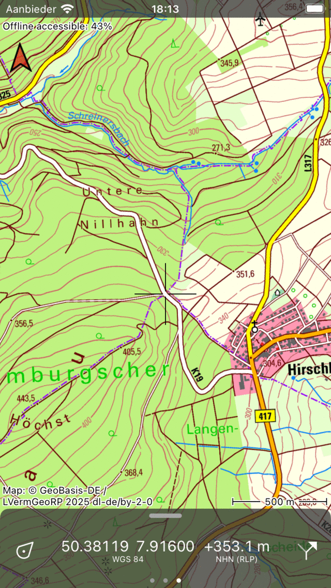
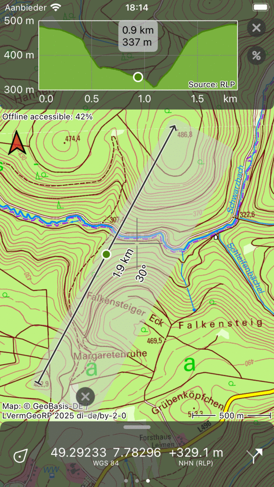
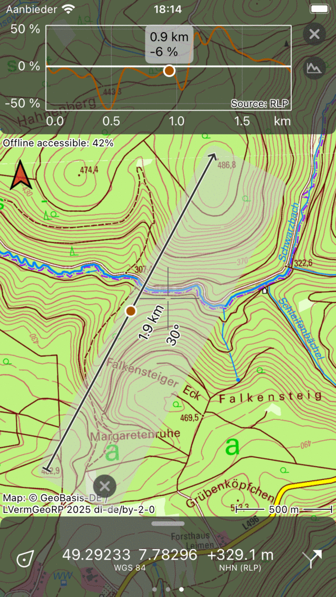
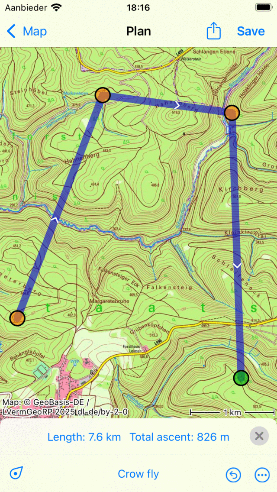
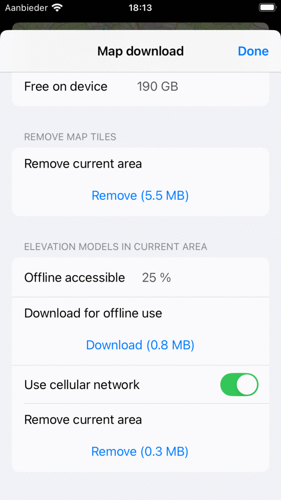

.. _sec-height-extension:

Height extension
================

It is possible to extend Topo GPS with the height extension. This extension allows you to do the following:

- :ref:`Displaying the terrain height (elevation) <ss-height-extension-display-height>` on the coordinates panel of the dashboard.
- Generate :ref:`quick height profiles <ss-quick-height-profiles>` with the map ruler.
- Generate :ref:`height profiles for routes planned with the transportation mode 'Crow fly' <ss-height-profile-crow-fly>`.
- Generate :ref:`more accurate height profiles <ss-height-profile-more-accurate>` for all planned routes.
- Generate height profiles for :ref:`routes that lack a height profile <ss-height-profile-lack>`.
- Show :ref:`height above ground <ss-height-above-ground>` and height above ground profiles.

.. _ss-height-extension-coverage:

Coverage
~~~~~~~~
The height extension is a paid extension and currently only available for Germany, England, Wales, France, Switzerland, Austria, The Netherlands, Belgium, and Luxembourg. In the future we will add more regions. If you purchase the height extension now, you will also get access to the regions that will be added in the future. 

.. _ss-height-extension-purchase:

Purchasing height extension
~~~~~~~~~~~~~~~~~~~~~~~~~~~
To purchase the height extension, zoom the map to one of the regions in which the height extension is available. Then slide the dashboard twice to the left to show the :ref:`coordinates panel <ss-coordinate-panel>`. Then tap on the coordinates panel and choose 'Show height' in the pop-up that appears. Then the purchase screen will appear.

.. _ss-height-extension-display-height:

Displaying terrain height
~~~~~~~~~~~~~~~~~~~~~~~~~
To display the terrain height in meters above sea level of a certain point, you have to slide the dashboard twice to the left to open the :ref:`coordinates panel <ss-coordinate-panel>`. Then the terrain height (elevation) of the point indicated with the cross in the center of the map will be displayed next to the coordinates as in the example below:

   
   *The terrain height is shown next to the coordinates on the dashboard.*

You can tap on the height to view details about the source, the vertical reference, and the accuracy. You have to zoom in the map far enough in a :ref:`region in which the height extension is available <ss-height-extension-coverage>` to view the terrain height.

If you tap on the position marker, you can view the terrain height of your current position.

If you tap on a point, the terrain height of the point is displayed just below the coordinates in the waypoint details screen.

.. _ss-quick-height-profiles:

Quick height profiles
~~~~~~~~~~~~~~~~~~~~~
To quickly obtain a height profile along a straight line, you have to activate the :ref:`map ruler <ss-map-ruler>`. Press long on the map so that a waypoint creation icon appears, then add a second finger to activate the ruler.
If the map ruler is in the :ref:`covered region <ss-height-extension-coverage>`, and the ruler is long enough, a height profile icon will appear next to the closing cross icon. If you tap the height profile icon, a profile will be shown in the top of the screen. This is the height profile along the line of the map ruler.

   
   *A height profile is generated using the map ruler.*

If you move the map ruler around, or change its size, the height profile will be immmediately updated. You can drag the point in the height profile window to read off heights. The point is also depicted on the map ruler, so that you can easily see the location of the point in the height profile on the map. 

You can zoom the profile in and out by putting two fingers on the profile window and moving them away from or to each other. 

If you tap the percentage icon next to the profile, a slope profile is generated. Depending on the slope units set in the Topo GPS settings, either the slope percentage or the slope angle is shown. It allows you to quickly see how steep a certain line is.

   
   *A slope profile is generated using the map ruler.*

.. _ss-height-profile-crow-fly:

Height profiles for routes planned using 'Crow fly'
~~~~~~~~~~~~~~~~~~~~~~~~~~~~~~~~~~~~~~~~~~~~~~~~~~~
If you did not :ref:`activate the height extension`, routes planned using the transportation mode 'crow fly' will not have a height profile. Purchasing the height extension ensures that the :ref:`routes planned <sec-route-plan>` using the transportation means 'crow fly' automatically get a height profile once the route lies in the :ref:`covered region of the height extension <ss-height-extension-coverage>`. An example is shown in the figure below:

   
   *With the height extension, crow fly planned routes will get a height profile.*

In the example, a crow fly route is planned. In the bottom the total ascent along the route is displayed. If you tap the total ascent the height profile will be displayed.

.. _ss-height-profile-more-accurate:

More accurate height profiles for planned routes
~~~~~~~~~~~~~~~~~~~~~~~~~~~~~~~~~~~~~~~~~~~~~~~~
The height information in used in the height extension is based on very accurate digital terrain models, obtained by laser scanning of the terrain by aircrafts. The vertical and horizontal accuracy is much higher than in the height data that is used in the route planner without the height extension. If you have bought the height extension you the height profiles will be based on the accurate digital terrain models. As a result the computed amount of total ascent will also be more accurate.

.. _ss-height-profile-lack:

Generate height profiles for routes that lack a height profile
~~~~~~~~~~~~~~~~~~~~~~~~~~~~~~~~~~~~~~~~~~~~~~~~~~~~~~~~~~~~~~
If you have imported a route that lacks a route, a height profile will be automatically generated if you open the :ref:`route details screen <sec-route-details>` of the route. If the route is long, you might have to tap on the button 'Generate height profile'. It can take a while before the height profile appears, because sometimes height information has to be downloaded first.

Generate terrain height profiles for recorded routes
~~~~~~~~~~~~~~~~~~~~~~~~~~~~~~~~~~~~~~~~~~~~~~~~~~~~
If you have recorded a route, the height is determined by the GPS and/or barometer of the device. Sometimes the height data obtained in this way is quite inaccurate, with huge fluctuations. Therfore we also display the terrain height profile below the recored height profile in the :ref:`route details screen <sec-route-details>`. This terrain height profile could be more usuable and give a more reliable estimate of the total ascent. However, sometimes the terrain height profile is very different from the actual profile, for example when somebody crosses a bridge over a valley. This bridge will be included in the recorded height profile, but not in the terrain height profile which follows the shape of the valley.

.. _ss-height-above-ground:

Height above ground
~~~~~~~~~~~~~~~~~~~
Especially when you are in the air, it might be of interest to get an estimate of the height with respect to the ground. The height from the GPS (altitude) is the height relative to the mean sea level. If you subtract the terrain height from that, you will get the height above the ground. If you tap on the position marker, you can view your current height above ground. 

If you have recorded a route, you can view the height above ground profile in the route details screen. If the route is aerial, the height above ground profile is already listed below the terrain height profile. If not you can tap on the height profile to view the profile details, and then in the top of the screen, you can switch the profile view to height above ground.

Technical details of the height extension
=========================================
Downloading
~~~~~~~~~~~
The height information is stored in tiles which have a size of 4 km x 4 km. These tiles have to be downloaded from our server and will be stored on your device. You can download the height information of a particular region by tapping 'Offline accessible' on the top left of the screen to open the map download screen. Then scroll down to the bottom to the section 'Height models'. Here you can tap 'Download' to download the height models for the currently visible region. You can also remove height models to reclaim storage space.

   
   *Downloading digital height models for offline use.*

If you have made the height models offline accessible, you can view heights and generate profiles without an internet connection. You can test this by putting your device temporarily to airplane mode with wifi disabled.

Accuracy
~~~~~~~~
The heights in the height extension are obtained from digital terrain models. These are very accurate big datasets, where heights are determined typically every 1 m using a laser from an aircraft. In the original dataset heights are accurate to in about 0.1 m. We have however reduced the accuracy a bit in a sophisticated way, to obtain a data size that is managable for an app. Our claimed accuracy is: 95% of the heights differ less than 0.5 m from the original measurement. This is a perfect accuracy for outdoor activities, not every bump is noticable, but small embankments are.

Privacy
~~~~~~~
To determine a height using the height extension, first the necessary height tile of 4 km x 4 km is determined. If the tile is not stored on your device, it is automatically downloaded from our server. Then the height is determined from this height tile on your device. Never will any coordinates be send to our server. The height extension is very privacy friendly, we cannot in anyway view the positions of your points or routes, if you determine a height or a height profile. 
