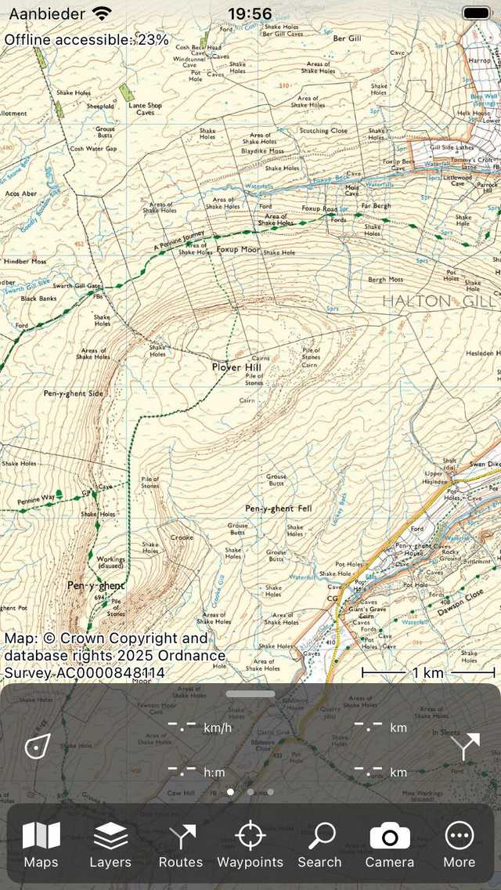
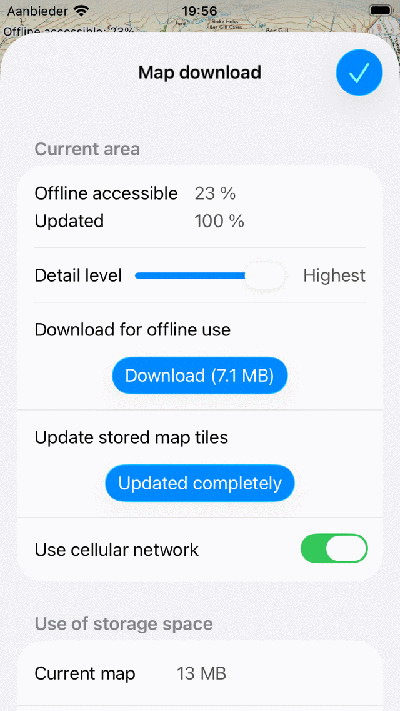
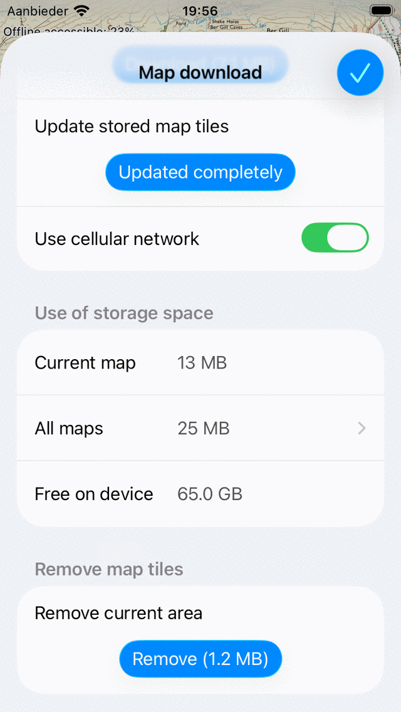

.. meta::
   :description: Describes how to make map tiles offline available in Topo GPS.

.. _sec-cache:

Making maps offline accessible
==============================
To ensure that the maps are accessible when your are not connected to internet (offline) you can make maps offline accessible. Offline accessible means that the maps are stored on your device and that you can view them without an internet connection.

Map tiles
~~~~~~~~~
The maps in Topo GPS are composed out of map tiles. A small number of map tiles is required to fill the map screen. If one or more of these required tiles are not stored on your device, they will be downloaded automatically. This only succeeds if you are connected to the internet.

If you are connected via a cellular network, downloading of map tiles can only occur if you have enabled cellular access for Topo GPS in the device settings > apps > Topo GPS. In Topo GPS you have to enable :ref:`Menu <sec-menu>` > More > Settings > Map tiles downloading > Use cellular network.

On the top left of the :ref:`main screen <sec-main-screen>` the percentage offline accessible map tiles of the currently visible area is shown. This percentage is the number of offline accessible tiles at all zoom levels relative to the total number of all possible tiles at all zoom levels. An example is shown in the figure below:

   *On the top left of the main screen you can view the percentage of the currently visible area that is offline accessible.*

In the figure above the percentage of offline accessible map tiles is less than 100%. By looking at the map screen you might think that all map tiles are already accessible, since the whole map screen is covered with tiles. However, if you zoom in, map tiles with a higher resolution will be loaded. If the percentage is not 100% it can happen that when you zoom in grey tiles or unsharp tiles are shown instead of the higher resolution map tiles.

.. _ss-cache-download:

Downloading map tiles
~~~~~~~~~~~~~~~~~~~~~
If you tap the label ‘Offline accessible:‘ on the top left of the map screen the map download screen will appear as in the figure below. Alternatively you can tap Menu > Maps > Download map.

In the map download screen you can download map tiles of the area that is currently visible in the map screen.  To download all map tiles of the current area, you have to press ‘Download’. The amount of MB indicates an estimate of the size of the download in megabytes.

If downloading of map tiles has been started, the download button shows how many tiles still need to be downloaded. While downloading map tiles, the percentage offline accessible will increase to 100%. You can cancel the downloading of map tiles at any time by pressing ‘Stop download’.

If you return to the map screen and do not move or zoom out on the map, you will see that the percentage offline accessible is 100%. In that case you are certain that you have all map tiles off the area stored on your device. To verify this, you could temporarily put your device on Airplane mode without WiFi access. If you then zoom in or out in regions with 100% offline accessiblity, no gray map tiles should appear.

Above the download button you can find a detail level slider. If you open the map download screen the detail level slider is always set to the highest detail level. This indicates that all possible map tiles will be downloaded if you press the download button. If you set this slider to a lower detail level, the tiles necessary for zooming in far will not be downloaded. As a result the download size will be much smaller, and you need less storage space. The offline percentage is then also computed with leaving out the highest resolution tiles. This could be useful if you only need an overview map of a certain area, and do not need to have all map tiles at the highest resolution possible. 

We recommend you to download only areas you really need, instead of very large regions. This will save you storage space and download time. If you really need to download a very large area it sometimes helps to split the download into smaller regions.

In the bottom of the 'Current area' section in the map download screen is the button 'Use cellular network'. If you have enabled this switch, you can use the cellular network for downloading map tiles. You also need to give permission to use the cellular network in the Device Settings > Apps > Topo GPS. If these settings are enabled, and you are viewing a part of the map on which map tiles are not stored offline, they will be downloaded automatically over the cellular network. If you have disabled the 'Use cellular network' setting, the cellular network will never be used to download map tiles. This can save you data transfer costs. It might happen however that grey tiles are shown in the map if you had not made all tiles of the area offline accessible.

Instead of downloading the map tiles of a specific region, it is also possible to only :ref:`download the map tiles over which a route is going <sec-route-map-tiles>`. For that open the :ref:`route details screen of a route <sec-route-details>`, scroll down to the section 'Tiles on current map' and tap 'Download'.

Updating map tiles
~~~~~~~~~~~~~~~~~~
Sometimes the updated map tiles are available for download. If updated map tiles are available and you view them in the map screen, they will be downloaded and updated automatically.

You can update all map tiles of a certain area in the map download screen. For this you have to press ‘Download (.. MB)’ in the update section of the map download screen. When the percentage updated map tiles equals the percentage offline accessible map tiles, you have updated all offline accessible map tiles. This is the case in the figure above, therefore the ‘Download’ button has changed to ‘Updated completely’.

Storage space
~~~~~~~~~~~~~
Storing of map tiles on your device costs disk space. In the map download screen you can see how much space has been used.

‘Current map’ means the total storage of the complete current map.

‘All maps’ means the total storage of all maps together. 

‘Free on device’ means the amount of available storage space on your device.

If you tap on 'All maps' you will get an overview of the storage space used for each map. If you tap on of the maps in this overview, the map will be opened, and you can then tap 'Offline accessible' > Scroll down > Remove to remove tiles to free up storage space.

<ANDROID>
Storage location
~~~~~~~~~~~~~~~~
If you scroll down in the map download screen you can set the storage location of the map tiles. 
You could for example set it to SD card. By default it is set to internal storage. By tapping the storage location, a screen will appear in which you can see all availble storage locations on your device. In this screen you can select a storage location. You could for example choose the SD card. Sometimes the namings are a bit unclear, but you might look at the available space to figure out which one is the SD card.

To optimally use the storage space on your SD card we recommend to format your SD card with a very small allocation unit size, like 8 kB.
The reason is that the map tiles have a typicaly size of somehwere between 0 and 100 kB. If you store them on a SD card with a allocation size of for example 128 kB, each map tile will use at least 128 kB of space on your SD card. This will result in a much higher storage space usage then necessary.

To format your SD card you can put it in a Windows computer. Then right click on the SD card in Explorer and select "Format". Then you can set the allocation unit size to a small value like 4 kB and reformat the SD card. Note that if you format your SD card you will loose all data contained on it.
</ANDROID>

Removing map tiles
~~~~~~~~~~~~~~~~~~
If you want to remove map tiles, you need to scroll down to the bottom of the map download screen. 
If you scroll to the bottom of the map download screen you will find a ‘Remove’ button as you can see below:

   *Removing map tiles.*

By pressing the ‘Remove’ button you delete all map tiles of the currently visible area in the map screen. In the example above these are all map tiles of the Shetland Islands. 
