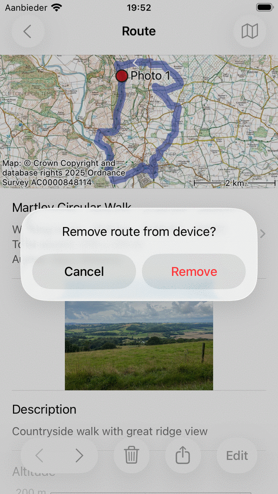

.. _sec-route-remove:

Removing routes
===============
To remove a route from your device you first have to open the :ref:`route details screen <sec-route-details>`.

You can do this by pressing the info button on the right hand side of a route in the :ref:`saved routes screen <sec-routes-load>` or by
tapping a route that is loaded on the map.

An example of the route details screen is displayed below:

   *The route details screen.*

<APPLE>
You can remove the route from your device by tapping the trash icon on the bottom of the route details screen. 
</APPLE>
<ANDROID>
You can remove the route from your device by tapping More > Remove in the top of the route details screen.
</ANDROID>
A pop-up will appear in which you have to confirm the removal as is shown below:

   *The remove popup.*

If you press ‘Remove’ the route will be removed from your device.

<APPLE>
If you have enabled :ref:`iCloud synchronization of routes <ss-routes-synchronize-icloud>` the route will also be removed from iCloud and from all devices that are synchronized with the same iCloud account.
</APPLE>

It is also possible to remove multiple routes at once. Open the saved routes screen (Menu > Routes > Saved routes). Press 'More > Select’ and :ref:`select <sec-routes-select>` the routes that need to be removed. Next press the trash icon on the <APPLE>bottom</APPLE><ANDROID>top</ANDROID> of the screen and confirm the removal.

If you only want to :ref:`remove a route from the map (and not from the device) <sec-routes-unload>` you have to tap the map with slash icon in the route details screen. 
